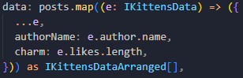

# Кошкотаблица на React, Typescript, Firebase, RTK, AntD

**_SPA-проект получения с удаленного сервера и отображения в табличном виде списка карточек с CRUD-операциями и функцией авторизации через учетную запись Google посредством Firebase_**

**_В качестве сервера и базы данных используется самостоятельно настроенная NoSQL БД Firestore от сервиса Firebase._**

---

### Использован шаблон c-r-a --template typescript

Для первичной инициализации проекта в его директории сперва нужно установить зависимости с помощью команды:

```sh
npm install
```

Для локального запуска проекта нужно использовать команду

```sh
npm start
```

### **_Важно!_** Ключи (переменные) для настройки окружения и конфигурации firebase хранятся локально и отсутствуют в репозитории. Необходим файл .env.local

## В проекте настроен CI/CD через GitHub Actions.


**_Деплой реализован через Netlify._**
**_Ссылка на продакшн стенд: [kitty-paws](https://kitty-paws.netlify.app/)_**

### Автоформатирование и проверка кода реализованы через Prettier и ESLint.

Для запуска линтинга можно использовать команду:

```sh
npm run lint
```

Для запуска автоисправления линтинга можно использовать команду:

```sh
npm run lint:fix
```

## В проекте использованы библиотеки

- [x] Typescript;
- [x] Firebase;
- [x] Redux Toolkit (включая RTK Query);
- [x] React Router;
- [x] Ant Design;
- [x] react-icons;
- [x] react-loader-spinner;
- [x] prettier;

React Router использован для навигации между страницами **Home** / **SingleCatPage** / **Contacts** / **Login** / **Not Found**
Рендер вложенных страниц реализован через компонент `<Outlet />` библиотеки `react-router-dom`
Также реализовано управление неавторизованным пользователем через хук `useNavigate`.

Работа с **SVG** организована и с использованием иконок библиотеки `react-icons`, и с использованием локальных файлов из директории `assets/icons`.

Описан кастомный хук **useControlNavigation** для совместной навигации в боковом меню (по ссылкам) и хедере (на лого) _(5ая версия AntD вынуждает использовать `useNavigation` вместо компонентов Link и NavLink из react-router-dom)_.

### Авторизация пользователей происходит согласно спецификации OAuth через провайдера **Google** посредством сервиса **Firebase**.

Контроль авторизации (в том числе сохранение пользователя при ранее выполненном входе) происходит на стороне сервера. Для реализации контроля за состоянием авторизации на стороне клиента использован кастомный хук **useAuth** с изменением состояния загрузки (отображения спиннера) и перенаправлением неавторизованного пользователя на страницу логина. Внутри использован слушатель через useEffect на хук Firebase `onAuthStateChanged`, позволяющий проверять авторизацию пользователей при каждом обращении к сервису.

Логика логаута оставлена внутри компонента LogoutButton в качестве примера "умного" компонента. Для выхода из аккаунта использован хук Firabase `signOut`.

### Для стейт менеджмента использован Redux Toolkit.

В сторе описан слайс userSlice, где хранятся данные юзера, которые сохраняются туда в том числе при проверке авторизации через Firebase и подтягивании данных пользователя с сервера.
Для упрощения доступа к данным пользователя реализован кастомный хук **useUserInfo**, куда вынесена логика обращения к стейту, хранящемуся в сторе Redux через хук `useSelector`.

Получение основных данных (списка котов) с сервера производится через связку RTK Query и API Firestore.
Для чего реализован сервис **catsApi**, в котором для работы с Firebase использованы методы fakeBaseQuery и queryFn (вместо fetchBaseQuery и query соответственно).
В функции получения списка всех котов `fetchCats` производится **трансформация данных** сервера при присвоении ответа возвращаемому полю data (поскольку _transformResponse_ в _queryFn_ недоступно).  
  
Также трансформация аналогично производится в экшне получения отдельного кота `fetchSingleCat`.

Также использован React **Context** (хуки `createContext` и `useContext`) для управления отображением Sider'а.

Реализован предохранитель в виде классового компонента **ErrorBoundary** использующего фоллбэк-компонент ErrorFalback c кнопкой попытки обновления страницы.  


В главной таблице данных реализована сортировка по популярности непосредственно в самом столбце `charm` и по отдельной кнопке, а также сброс условия сортировки на отдельной кнопке. При этом логический слой наполнения и управления таблицей вынесен в кастомный хук **useControlTable**.

Библиотека react-loader-spinner - минималистичная библиотека анимированных спиннеров, готовых к использованию с возможностью небольшой кастомизации. Использована в компоненте Loader'а.  


Настроен адаптивный дизайн для таблицы (весь сайт адаптивен).

---

Любые замечания по работе приложения приветствуются 😊
