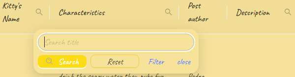

# Кошкотаблица на React, Typescript, Firebase, RTK, AntD

**_SPA-проект получения с удаленного сервера и отображения в табличном виде списка карточек со всеми CRUD-операциями и функцией авторизации через учетную запись Google посредством Firebase_**

**_В качестве сервера и базы данных используется самостоятельно настроенная NoSQL БД Firestore от сервиса Firebase._**

---

### Использован шаблон c-r-a --template typescript

Для первичной инициализации проекта в его директории сперва нужно установить зависимости с помощью команды:

```sh
npm install
```

Для локального запуска проекта нужно использовать команду

```sh
npm start
```

### **_Важно!_** Ключи (переменные) для настройки окружения и конфигурации firebase хранятся локально и отсутствуют в репозитории. Необходим файл .env.local

## В проекте настроен CI/CD через GitHub Actions.


**_Деплой реализован через Netlify._**
**_Ссылка на продакшн стенд: [kitty-paws](https://kitty-paws.netlify.app/)_**

### Автоформатирование и проверка кода реализованы через Prettier и ESLint.

Для запуска линтинга можно использовать команду:

```sh
npm run lint
```

Для запуска автоисправления линтинга можно использовать команду:

```sh
npm run lint:fix
```

## В проекте использованы библиотеки

- [x] Typescript;
- [x] Firebase;
- [x] Redux Toolkit (включая RTK Query);
- [x] React Router;
- [x] Ant Design;
- [x] react-icons;
- [x] react-loader-spinner;
- [x] prop-types;
- [x] prettier;

## Реализованные обязательные требования:

**_React_**

1. Функциональные компоненты c хуками в приоритете над классовыми. Описан только один классовый компонент `ErrorBoundary`.
2. Есть разделение на умные: [`SignOut`](https://github.com/KamajorQA/Kitty_Paws/blob/master/src/components/SignOut.tsx), [`DeleteButton`](https://github.com/KamajorQA/Kitty_Paws/blob/master/src/components/DeleteButton.tsx) и глупые: [`BaseLink`](https://github.com/KamajorQA/Kitty_Paws/blob/master/src/components/BaseLink.jsx), [`Loader`](https://github.com/KamajorQA/Kitty_Paws/blob/master/src/components/Loader.tsx) компоненты.
3. Есть рендеринг списков: [Carousel](https://github.com/KamajorQA/Kitty_Paws/blob/master/src/components/CarouselComponent.tsx#L30), [Table](https://github.com/KamajorQA/Kitty_Paws/blob/master/src/components/CatsTable.tsx#L18).
4. Реализована работа с формой добавления новой сущности в БД: [`AddCatForm`](https://github.com/KamajorQA/Kitty_Paws/blob/master/src/components/AddCatForm.tsx).  
   Использован компонент формы из библиотеки **Ant Design**.  
    Поля формы валидируются (по минимальной и максимальной длине, url - по формату, по заполненности).  
    Реализована обработка формы, включая трансформацию значений для полей незаполненных (ссылка на изображение) или недобавляемых (данные об авторе и массив лайков) пользователем.
5. Есть применение React **Context** API (хуки [`createContext`](https://github.com/KamajorQA/Kitty_Paws/blob/master/src/context/SiderContext.tsx#L8) и [`useContext`](https://github.com/KamajorQA/Kitty_Paws/blob/master/src/components/HeaderComponent.tsx#L21)) для управления отображением Sider'а.
6. Реализован предохранитель в виде классового компонента [**ErrorBoundary**](https://github.com/KamajorQA/Kitty_Paws/blob/master/src/components/ErrorBoundary.tsx) использующего фоллбэк-компонент [`ErrorFalback`](https://github.com/KamajorQA/Kitty_Paws/blob/master/src/components/ErrorFallback.tsx) c кнопкой попытки обновления страницы.  
   
7. Используются **_кастомные хуки_**:
   - [**useControlNavigation**](https://github.com/KamajorQA/Kitty_Paws/blob/master/src/hooks/useControlNavigation.ts) - для совместной навигации в боковом меню (по ссылкам) и хедере (на лого) _(5ая версия AntD вынуждает использовать `useNavigation` вместо компонентов Link и NavLink из react-router-dom)_.
   - [**useAuth**](https://github.com/KamajorQA/Kitty_Paws/blob/master/src/hooks/useAuth.ts) - контроль за состоянием авторизации через **Firebase** на стороне клиента с изменением состояния загрузки (отображения спиннера) и перенаправлением неавторизованного пользователя на страницу логина. Внутри использован слушатель через useEffect на хук Firebase `onAuthStateChanged`, позволяющий проверять авторизацию пользователей при каждом обращении к сервису.
   - [**useUserInfo**](https://github.com/KamajorQA/Kitty_Paws/blob/master/src/hooks/useUserInfo.ts) - упрощение доступа к данным пользователя сохраненным в стор **Redux**. В этот хук вынесена логика обращения к стейту юзера, хранящемуся в сторе через _типизированный_ хук `useAppSelector`.
   - [**useControlTable**](https://github.com/KamajorQA/Kitty_Paws/blob/master/src/hooks/useControlTable.tsx) - в данный кастомный хук вынесен логический слой наполнения и управления главной таблицей данных.
   - [**useLike**](https://github.com/KamajorQA/Kitty_Paws/blob/master/src/hooks/useLike.ts) - логика обработки постановки и снятия лайка, которые доступны на главной странице, на странице конкретного кота и на странице избранного с синхронизацией данных.
   - [**reduxHooks**](https://github.com/KamajorQA/Kitty_Paws/blob/master/src/hooks/reduxHooks.ts) - типизированные хуки `useDispatch` и `useSelector` из библиотеки _react-redux_ для упощения использования в остальных компонентах с **TypeScript**.
8. Хотя бы несколько компонентов используют проверку типов с помощью PropTypes:  
   в качестве примера валидации пропсов через prop-types переписаны компоненты [`Title`](https://github.com/KamajorQA/Kitty_Paws/blob/master/src/components/Title.jsx) и [`BaseLink`](https://github.com/KamajorQA/Kitty_Paws/blob/master/src/components/BaseLink.jsx).
9. Реализовано применение lazy + Suspense.  
   Ленивыми сделаны все [страницы](https://github.com/KamajorQA/Kitty_Paws/blob/master/src/App.tsx#L8) кроме главного лейаута для плавной анимации и постоянной структуры страницы без мерцаний.  
   Компонент `Suspense` применяется лишь однократно в [`MainLayout`'е](https://github.com/KamajorQA/Kitty_Paws/blob/master/src/layouts/MainLayout.tsx#L25) вокруг компонента `<Outlet />`.

**_Redux_**

1. Для стейт менеджмента использован Modern Redux with **Redux Toolkit**: [store](https://github.com/KamajorQA/Kitty_Paws/blob/master/src/store/index.ts).
2. В сторе описан слайс [**userSlice**](https://github.com/KamajorQA/Kitty_Paws/blob/master/src/store/slices/userSlice.ts), где хранятся данные юзера, которые сохраняются туда в том числе при проверке авторизации через Firebase и подтягивании данных пользователя с сервера.
3. Есть хотя бы одна кастомная мидлвара: `setUserMiddleware`.
4. Используется **RTK Query**:  
   Получение основных данных (списка котов) с сервера производится через связку RTK Query и API Firestore.
   Для чего реализован сервис [**catsApi**](https://github.com/KamajorQA/Kitty_Paws/blob/master/src/store/services/catsApi.ts), в котором для работы с Firebase использованы методы `fakeBaseQuery` и `queryFn` (вместо fetchBaseQuery и query соответственно).  
   При этом в RTK Query API реализованы все **_CRUD-операции_**:

   - **create** - `addNewCat` - создание новой сущности в БД. Вызывается на странице добавления нового кота (при сабмите обработанной формы. Поля валидируются. Доступно любому авторизованному пользователю.
   - **read**:
     - `fetchCats` - метод чтения всех котов c сервера;
     - `fetchSingleCat` - метод получения отдельного кота;
     - `fetchFavorites` - отдельный метод частичного запроса из БД Firestore через query-запрос для получения избранного для текущего пользователя. Таким образом, обработка списка избранного происходит на сервере и запрашивается непосредственно на странице избранного. На самой странице избранного для отображения списка карточек использован **слайдер**.
   - **update** - `updateCatLike` - частичное изменение отдельной записи (постановка/снятие лайка). Лайкнувший пользователь добавляется/удаляется соответствующем массиве в БД). Постановка и снятие лайка доступны на главной странице, на странице конкретного кота и на странице избранного с синхронизацией данных (логика вынесена в кастомный хук `useLike`).
   - **delete** - `deleteCat` - удаление отдельной записи из БД. Удаление доступно на странице отдельной сущности и только владельцу кота (создателю записи).

5. Применяется **трансформация ответа** сервера:
   - в функции получения списка всех котов [`fetchCats`](https://github.com/KamajorQA/Kitty_Paws/blob/master/src/store/services/catsApi.ts#L52) производится трансформация данных из ответа сервера при присвоении ответа возвращаемому полю data (поскольку _transformResponse_ в _queryFn_ недоступно).  
     
   - аналогично трансформация производится в экшне получения отдельного кота [`fetchSingleCat`](https://github.com/KamajorQA/Kitty_Paws/blob/master/src/store/services/catsApi.ts#L71).

## Реализованные необязательные требования:

1. Использование **TypeScript**.
2. Имплементация **Firebase**.
   Авторизация пользователей происходит согласно спецификации **OAuth** через провайдера **Google** посредством сервиса **Firebase**.
   Контроль авторизации (в том числе сохранение пользователя при ранее выполненном входе) происходит на стороне сервера (проверка состояния авторизации на стороне клиента - через описанный выше кастомный хук `useAuth`).  
   Кроме того, Firebase использован в качестве **бэкенда** - сервер и база данных развернуты на самостоятельно настроенной NoSQL БД Firestore.
3. Настроен **CI/CD** через **_GitHub Actions_** и [**Netlify**](https://kitty-paws.netlify.app/).  
   

### Дополнительные пояснения:

Для общего дизайна использована библиотека UI-компонентов **Ant Design**.

React Router использован для навигации между страницами **Home** / **Single Cat** / **Favorite** / **User Info** / **New Cat** / **Contacts** / **Login** / **Not Found**  
Рендер вложенных страниц реализован через компонент `<Outlet />` библиотеки `react-router-dom`  
Также реализовано управление неавторизованным пользователем через хук `useNavigate`.

Работа с **SVG** организована и с использованием иконок библиотеки `react-icons`, и с использованием локальных файлов из директории `assets/icons`.

**Поиск** реализован на стороне клиента, поскольку в качестве бэкенда использован Firebase - **_Firestore не поддерживает_** [**_полнотекстовый поиск_**](https://firebase.google.com/docs/firestore/solutions/search?hl=ru&provider=algolia).  
Возможно только подключение одной из 3 специальных сторонних служб поиска: _elastic_, _algolia_ или _typesense_. Бесплатный стартовый пакет доступен только у Алголии, однако, в настоящее время она блокирует пользователей из России.  
По этим причинам реализация поиска оставлена через фильтрацию данных на клиентской стороне.  
**Логика поиска** вынесена в кастомный хук `useSearch`, который фактически дополняет хук `useControlTable`, предоставляя последнему метод сортировки, добавляемый в конкретные столбцы таблицы.  
Поиск может проводиться по трем столбцам `Kitty's Name` / `Characteristics` / `Description` (возможна одновременная фильтрация по условиям во всех трех столбцах).  


Кроме того в главной таблице данных реализована **_сортировка по популярности_** непосредственно в самом столбце `charm` и по отдельной кнопке, а также сброс условия сортировки на отдельной кнопке (логика управления - в вышеуказанном кастомном хуке `useControlTable`).

Библиотека **_react-loader-spinner_** - минималистичная библиотека анимированных спиннеров, готовых к использованию с возможностью небольшой кастомизации. Использована в компоненте `Loader`'а.  


Настроен адаптивный дизайн для таблицы (весь сайт адаптивен).

---

Любые замечания по работе приложения приветствуются 😊
